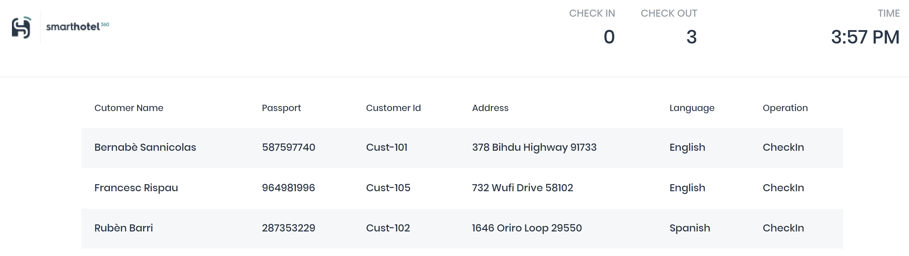

# Challenge 0: Environment Setup - Coach's Guide

**[Home](./README.md)** - [Next Challenge >](./01-design.md)

## Before you start

- Introduce housekeeping: breaks, lunch, cameras on ideally, etc

## Solution Guide

- As a coach you should have already [deployed the Lab](./LabDeployment/readme.md) and ensure that enough user accounts have been created for all of your hack participants.
- Make sure participants test connectivity to Azure and can see all 3 RGs
- Confirm they have connectivity to Azure host VM:
    - Discuss RDP vs Bastion <- for simplicity start with RDP, Bastion may be required if outbound RDP blocked
    - Accept RDP open to internet is a security risk - consider restricting source IPs to lock it down a little more
- Check participants can see the SmartHotel application by accessing the public IP of the host VM. It should return results similar to this:

